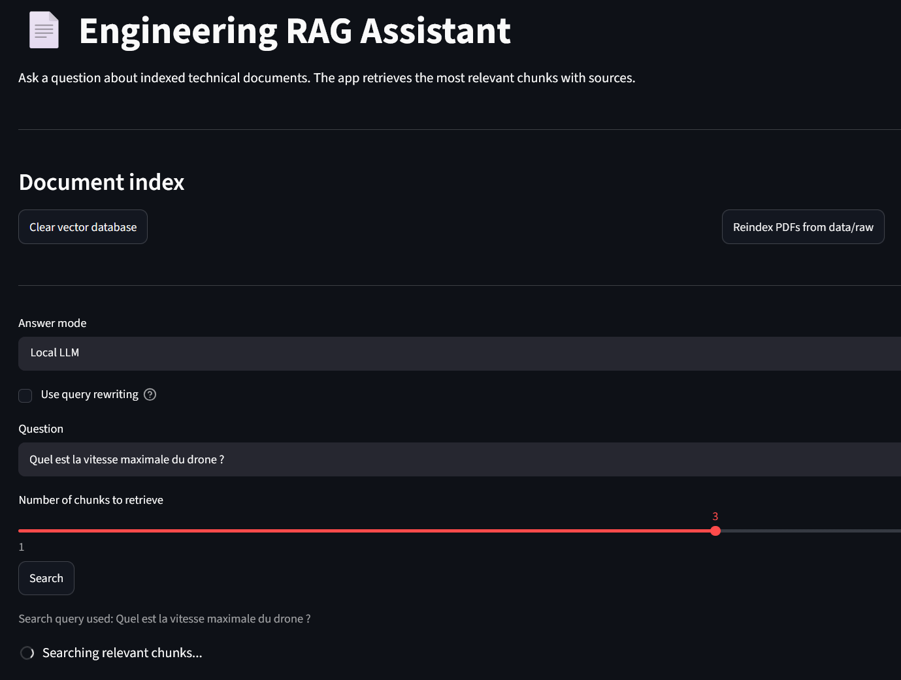
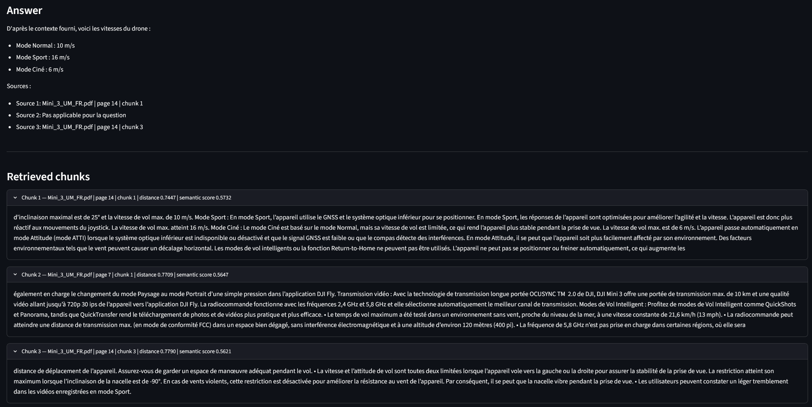

# Engineering RAG Assistant — V1.1

A local Retrieval-Augmented Generation application designed to search, inspect and answer questions from engineering and technical PDF documents.

The project focuses on a transparent and testable RAG pipeline rather than a generic PDF chatbot. It combines incremental document indexing, dense and lexical retrieval, local LLM generation, chunk-level inspection and a small retrieval evaluation framework.

---

## Demo




---

## What's new in V1.1

V1.1 turns the first working prototype into a more structured retrieval experimentation platform.

Main additions:

- incremental PDF indexing
- detection of new, modified, unchanged and deleted documents
- page and chunk quality metadata
- Chunk Explorer connected directly to ChromaDB
- dense retrieval with BGE-M3
- lexical retrieval with BM25
- hybrid search with Reciprocal Rank Fusion (RRF)
- deterministic local query rewriting with Ollama
- comparison of four retrieval strategies
- retrieval evaluation with Page Hit@k and Mean Reciprocal Rank
- detailed JSON evaluation reports
- unit tests for BM25 and RRF

---

## Features

### Document ingestion and indexing

- Index every PDF stored in `data/raw`
- Extract text page by page
- Ignore empty or rejected pages
- Split pages into overlapping chunks
- Store embeddings and metadata in persistent ChromaDB
- Reindex incrementally instead of rebuilding the complete database
- Detect:
  - new documents
  - modified documents
  - unchanged documents
  - deleted documents
- Preserve page number, source filename, chunk ID and extraction metadata
- Attach an informative quality status to each chunk

### Retrieval

Four retrieval strategies are available:

1. Dense retrieval with BGE-M3
2. Dense retrieval with deterministic query rewriting
3. Hybrid retrieval with BGE-M3 + BM25 + RRF
4. Hybrid retrieval with deterministic query rewriting

The hybrid mode combines:

```text
Dense semantic retrieval
        +
BM25 lexical retrieval
        ↓
Reciprocal Rank Fusion
        ↓
Final ranked chunks
```

The two engines are fused from their ranks rather than from their raw scores, because Chroma distances and BM25 scores are not directly comparable.

### Retrieval inspection

For every retrieved chunk, the interface can display:

- retrieval mode
- source document
- page number
- chunk ID
- extraction quality
- Chroma distance
- semantic score
- dense rank
- BM25 rank
- BM25 score
- RRF score

### Chunk Explorer

The Chunk Explorer reads ChromaDB directly and makes the indexed corpus inspectable.

It supports filtering by:

- document
- page
- quality status

It also displays:

- matching chunk count
- clean chunk count
- degraded chunk count
- extraction method
- quality reason
- stored Chroma identifier
- full chunk text

### Local answer generation

The application can generate answers with a local Ollama model.

The generation prompt instructs the model to:

- answer only from retrieved context
- avoid unsupported assumptions
- state when the answer is not available
- cite source documents and pages

### Query rewriting

An optional local Ollama model rewrites the user question into a short retrieval-oriented sentence.

The application keeps the original question and appends the rewritten query instead of replacing it:

```text
original question + rewritten query
```

The rewrite configuration uses:

- `temperature = 0`
- a fixed seed
- disabled thinking mode
- fallback to the original question if the model returns an empty response

The feature remains experimental because a rewrite may improve or degrade retrieval depending on the query.

---

## Preliminary retrieval evaluation

The project includes a small golden dataset:

```text
data/evaluation/rag_evaluation_questions.json
```

Current benchmark scope:

- 10 manually verified questions
- 5 technical PDF documents
- relevance evaluated at document + page level
- metrics:
  - Page Hit@1
  - Page Hit@3
  - Page Hit@5
  - Page MRR

Best measured configuration on the current benchmark:

| Retrieval strategy | Hit@1 | Hit@3 | Hit@5 | Page MRR |
|---|---:|---:|---:|---:|
| Hybrid BGE-M3 + BM25 + RRF | 90% | 90% | 90% | 0.900 |
| Hybrid + query rewriting | 90% | 90% | 90% | 0.900 |

These results are preliminary. With only 10 questions, one error changes a metric by 10 percentage points. The benchmark is therefore used to compare retrieval behaviour and identify failure cases, not to claim production-level performance.

One observed case is particularly useful: hybrid retrieval improves most top rankings but can demote a page that dense retrieval had ranked correctly. The project intentionally keeps neutral RRF weights instead of tuning them to repair a single benchmark question.

---

## Tech stack

- Python
- Streamlit
- pypdf
- LangChain
- ChromaDB
- SentenceTransformers / Hugging Face embeddings
- custom BM25 implementation
- Reciprocal Rank Fusion
- Ollama
- pytest
- python-dotenv

Current embedding model:

```text
BAAI/bge-m3
```

Local generation and query rewriting models are configurable through a local `.env` file.

Default models:

```text
OLLAMA_MODEL=gemma4:12b
QUERY_REWRITE_MODEL=gemma4:12b
```

Any compatible model already available in Ollama can be selected without modifying the Python code. Retrieval-only mode does not require Ollama.

---

## Project structure

```text
.
├── assets/
│   ├── demo1.png
│   └── demo2.png
├── data/
│   ├── evaluation/
│   │   ├── rag_evaluation_questions.json
│   │   └── retrieval_report_*.json
│   ├── raw/
│   │   └── PDF files to index
│   └── vector_db/
│       └── Local Chroma database
├── src/
│   ├── config.py
│   ├── chunking/
│   │   └── splitter.py
│   ├── embeddings/
│   │   └── embedder.py
│   ├── evaluation/
│   │   ├── __init__.py
│   │   └── evaluate_retrieval.py
│   ├── generation/
│   │   ├── ollama_generator.py
│   │   └── query_rewriter.py
│   ├── ingestion/
│   │   └── pdf_loader.py
│   ├── pipeline/
│   │   └── indexing_pipeline.py
│   ├── retrieval/
│   │   ├── bm25_index.py
│   │   ├── hybrid_fusion.py
│   │   ├── reranker.py
│   │   └── retriever.py
│   └── vectorstore/
│       └── chroma_store.py
├── tests/
│   ├── test_bm25_index.py
│   └── test_hybrid_fusion.py
├── streamlit_app.py
├── requirements.txt
├── .env.example
├── .gitignore
└── README.md
```

The exact repository structure may evolve as the pipeline is modularized further.

---

## Installation

Clone the repository:

```bash
git clone https://github.com/pierre-b-ai/engineering-rag-assistant.git
cd engineering-rag-assistant
```

Create and activate a virtual environment.

Windows PowerShell:

```powershell
python -m venv .venv
.venv\Scripts\Activate.ps1
```

Install dependencies:

```powershell
pip install -r requirements.txt
```

Create your local configuration file from the public template:

```powershell
Copy-Item .env.example .env
```

The command keeps `.env.example` and creates a separate local `.env` file with the same initial content.

Edit `.env` to select models available on your machine:

```env
OLLAMA_URL=http://localhost:11434/api/generate
OLLAMA_MODEL=gemma4:12b
QUERY_REWRITE_MODEL=gemma4:12b
```

The `.env` file is local and must not be committed. The `.env.example` template is versioned so that every user knows which variables are supported.

---

## Ollama setup

Ollama is required only for:

- local answer generation
- optional query rewriting

Dense and hybrid retrieval can be used without Ollama.

Install Ollama, then pull the models selected in your `.env` file. With the default configuration:

```powershell
ollama pull gemma4:12b
```

Another compatible local model can be selected without modifying the Python source code, for example:

```env
OLLAMA_MODEL=llama3.1:8b
QUERY_REWRITE_MODEL=qwen3:8b
```

The selected models must already be installed in Ollama.

Make sure Ollama is running locally. The default server address is:

```text
http://localhost:11434
```

---

## Usage

Place one or more PDF files inside:

```text
data/raw/
```

Launch the Streamlit application:

```powershell
streamlit run streamlit_app.py
```

The interface contains three tabs.

### Search and answer

1. Select an answer mode:
   - `Retrieval only`
   - `Local LLM`
   - `API LLM (coming soon)`
2. Select a retrieval method:
   - `Dense (BGE-M3)`
   - `Hybrid (BGE-M3 + BM25/RRF)`
3. Enable query rewriting when needed
4. Enter a question
5. Select the number of final chunks
6. Click **Search**

### Chunk Explorer

Use this tab to inspect exactly what is stored in ChromaDB.

Filters are available for:

- source document
- page
- extraction quality

### Index management

Use this tab to:

- index new PDFs
- update modified PDFs
- remove deleted documents from the index
- inspect ingestion statistics and rejected pages
- clear the vector database when a complete rebuild is required

---

## How it works

### 1. PDF ingestion

PDF files are loaded from `data/raw` and processed page by page.

Each accepted page keeps metadata including:

- source filename
- page number
- extraction method
- extraction quality information

Text-based PDFs are supported. Scanned documents still require an OCR pipeline.

### 2. Chunking

Pages are split with an overlapping recursive text splitter.

Current configuration:

```python
CHUNK_SIZE = 1200
CHUNK_OVERLAP = 250
MIN_CHUNK_LENGTH = 300
```

Each chunk keeps its document, page and local chunk identifier.

### 3. Incremental indexing

The indexing pipeline compares the current files in `data/raw` with the indexed corpus.

It distinguishes:

```text
new
modified
unchanged
deleted
```

Only new or modified documents are processed again. Deleted documents are removed from ChromaDB.

This avoids rebuilding the complete vector database after every document change.

### 4. Chunk quality metadata

Each indexed chunk receives an informative quality status such as:

```text
clean
degraded
```

The quality metadata helps inspect extraction problems but does not currently alter retrieval scores.

This is intentionally transparent: a questionable extraction remains visible in the Chunk Explorer instead of being silently discarded.

### 5. Embeddings and vector storage

Chunks are embedded locally with:

```text
BAAI/bge-m3
```

Embeddings and chunk metadata are stored in a persistent ChromaDB collection:

```text
engineering_docs
```

Local storage path:

```text
data/vector_db/
```

### 6. Dense retrieval

The dense retriever:

1. embeds the user query with BGE-M3
2. retrieves a larger internal candidate set from ChromaDB
3. applies a lightweight reranking function
4. returns only the requested final chunks

Broad questions retrieve more internal candidates than precise questions.

The readable semantic score is currently derived from the Chroma distance:

```python
semantic_score = 1 / (1 + distance)
```

### 7. BM25 lexical retrieval

BM25 creates an in-memory lexical index from the chunks already stored in ChromaDB.

It is useful for:

- model references
- error codes
- exact technical vocabulary
- numbers and units
- table-oriented questions

The BM25 cache is rebuilt automatically when the indexed corpus changes.

### 8. Hybrid fusion

Dense and BM25 candidate lists are combined with Reciprocal Rank Fusion:

```python
rrf_score = (
    dense_weight / (rrf_k + dense_rank)
    + bm25_weight / (rrf_k + bm25_rank)
)
```

Current configuration:

```python
RRF_K = 60
DENSE_WEIGHT = 1.0
BM25_WEIGHT = 1.0
```

Equal weights are intentionally kept as a neutral baseline. They have not been optimized against the current 10-question benchmark.

### 9. Query rewriting

The optional rewriter generates one short French retrieval query while preserving:

- model names
- references
- codes
- numbers
- units
- the original intent

The rewritten query is stored in evaluation reports together with the final search query.

### 10. Local LLM generation

When `Local LLM` mode is selected, the final chunks are sent to Ollama.

The answer is generated from the retrieved context and displayed together with the supporting chunks.

---

## Evaluation commands

Validate the question dataset:

```powershell
python -m src.evaluation.evaluate_retrieval --validate-only
```

Dense baseline:

```powershell
python -m src.evaluation.evaluate_retrieval `
  --retriever src.retrieval.retriever:retrieve_relevant_chunks `
  --output data/evaluation/retrieval_report_dense_baseline.json
```

Dense with query rewriting:

```powershell
python -m src.evaluation.evaluate_retrieval `
  --retriever src.retrieval.retriever:retrieve_relevant_chunks_with_rewrite `
  --output data/evaluation/retrieval_report_dense_rewrite.json
```

Hybrid retrieval:

```powershell
python -m src.evaluation.evaluate_retrieval `
  --retriever src.retrieval.retriever:retrieve_relevant_chunks_hybrid `
  --output data/evaluation/retrieval_report_hybrid.json
```

Hybrid retrieval with query rewriting:

```powershell
python -m src.evaluation.evaluate_retrieval `
  --retriever src.retrieval.retriever:retrieve_relevant_chunks_hybrid_with_rewrite `
  --output data/evaluation/retrieval_report_hybrid_rewrite.json
```

Each report records:

- original question
- rewritten query when enabled
- final search query
- retrieval mode
- expected document and page
- first relevant rank
- Hit@k results
- retrieved chunks
- dense, BM25 and RRF ranking information

---

## Tests

Run the current unit tests:

```powershell
python -m pytest -q
```

The current tests validate the BM25 and RRF building blocks independently from the full application.

---

## Current limitations

- text-based PDF extraction only
- no OCR pipeline for scanned documents
- extraction quality detection is heuristic
- some corrupted text can still be misclassified as clean
- degraded chunks are visible but not yet penalized during retrieval
- the retriever always returns the requested number of chunks, even when only one result is strongly relevant
- no confidence threshold or dynamic final `k`
- lightweight reranking rather than a cross-encoder
- no HTML or Office document ingestion
- evaluation dataset limited to 10 questions
- no separate validation and final test split yet
- no FastAPI backend
- no authentication or multi-user document collections
- no production observability
- API LLM mode is not implemented

---

## Roadmap

### V1.x

- enlarge the evaluation dataset
- separate validation and test questions
- improve corrupted-text and chunk-quality detection
- evaluate quality-based retrieval penalties
- add dynamic result filtering instead of always forcing `k` chunks
- compare BGE-M3 with other multilingual embedding models
- evaluate a cross-encoder reranker
- add OCR for scanned technical documents
- add HTML and Office document ingestion
- improve test coverage

### V2

A future V2 is expected to move from a Streamlit prototype to a deployable application architecture:

```text
Next.js frontend
        ↓
FastAPI backend
        ↓
Modular RAG service
        ├── ingestion
        ├── dense retrieval
        ├── BM25
        ├── fusion
        ├── reranking
        └── local generation
```

Potential V2 capabilities:

- document upload and deletion through the interface
- multiple document collections
- conversation history
- direct links to cited PDF pages
- Docker Compose deployment
- background indexing jobs
- API-based retrieval and generation
- authentication
- tracing and observability
- optional agentic retrieval workflow

---

## Why this project matters

Technical documentation is often long, fragmented and difficult to search manually.

This project explores how a RAG application can retrieve grounded information from engineering documents while keeping every important stage inspectable:

- what was indexed
- how the text was chunked
- which chunks were retrieved
- which retrieval strategy ranked them
- which document and page support the answer
- how retrieval quality changes across experiments

The objective is not only to generate an answer, but to build a RAG system whose behaviour can be examined, measured and improved.

---

## Status

**V1.1 working local application.**

The project currently supports:

- incremental PDF indexing
- persistent ChromaDB storage
- dense and hybrid retrieval
- deterministic query rewriting
- local Ollama generation
- chunk-level quality inspection
- retrieval evaluation with JSON reports
- preliminary BM25/RRF tests

The current version is intended as a transparent engineering portfolio project and a foundation for a future FastAPI + Next.js V2.
